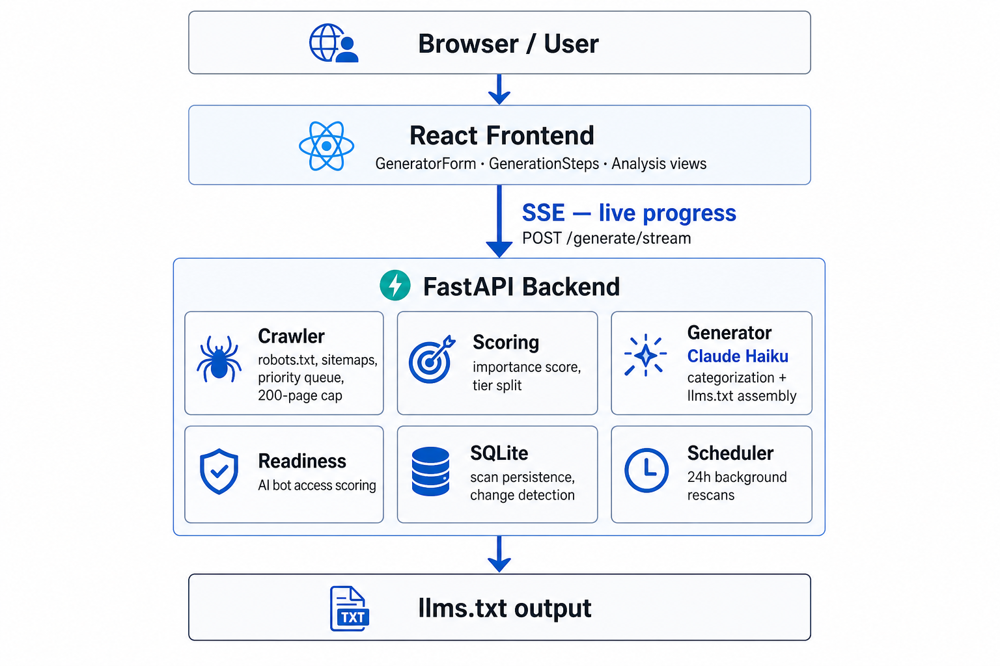

# llms.txt Generator

Generate spec-compliant [llms.txt](https://llmstxt.org) files from any website URL.

**Live app:** [https://llms-generator.up.railway.app/](https://llms-generator.up.railway.app/)

The backend crawls a site, scores page importance, categorizes the top pages with **Claude Haiku**, and assembles a structured llms.txt file. The frontend streams live progress over **SSE** (`POST /generate/stream`) so users can follow each pipeline stage as it runs.

## Usage

1. Enter any site URL on the homepage (e.g. `https://stripe.com`).
2. Watch generation progress: access check → sitemap discovery → crawl → readiness analysis → generate.
3. Review the analysis page: AI readiness score, category breakdown, and the generated llms.txt.
4. Copy or download the file. Revisit past scans from the recent scans list on the homepage.

## Architecture



The React frontend connects to the backend over **SSE** (`POST /generate/stream`), pushing stage updates and crawl counts to the UI in real time — no polling. The FastAPI backend crawls the site, ranks pages with a deterministic importance score, sends the top tier to **Claude Haiku** for categorization, and persists results to SQLite. A background scheduler re-scans domains every 24 hours.

For pipeline design choices and tradeoffs, see the [Backend README](./backend/README.md). For UI components and data flow, see the [Frontend README](./frontend/README.md).

## Project Structure

```
.
├── backend/     # FastAPI crawler + llms.txt generator
├── frontend/    # React + Vite UI
└── docs/        # Architecture diagram
```

## Quick Start

**Prerequisites:** Python 3, Node.js. `ANTHROPIC_API_KEY` is optional — fallback categorization works without it, but Claude produces better section groupings.

### Backend

```bash
cd backend
python3 -m venv .venv
source .venv/bin/activate
pip install -r requirements.txt
cp .env.example .env   # set ANTHROPIC_API_KEY
uvicorn main:app --reload --port 8000
```

API runs at `http://localhost:8000`.

### Frontend

```bash
cd frontend
npm install
cp .env.example .env   # VITE_API_URL defaults to http://localhost:8000
npm run dev
```

App runs at `http://localhost:5173`.

## Documentation

- [Backend README](./backend/README.md) — pipeline, design choices, API endpoints, configuration
- [Frontend README](./frontend/README.md) — components, data flow, environment variables
