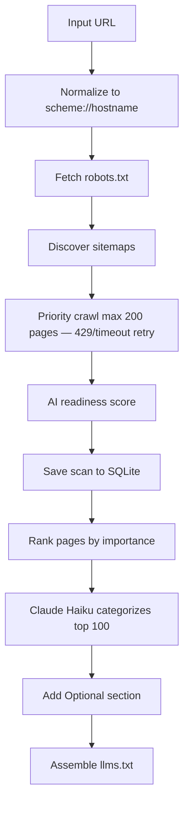
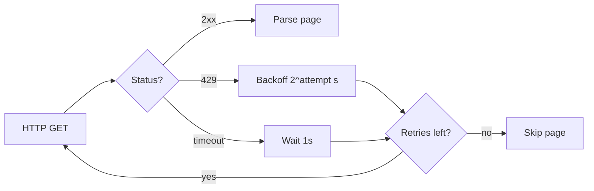

# Backend — Automated llms.txt Generator

FastAPI backend that crawls a website and generates a spec-compliant [llms.txt](https://llmstxt.org) file.

## Contents

- [System Architecture](#system-architecture)
- [How It Works](#how-it-works)
- [Setup](#setup)
- [Running](#running)
- [Environment Variables](#environment-variables)
- [API](#api)
- [Database](#database)
- [Project Layout](#project-layout)
- [Configuration](#configuration)
- [Known Limitations](#known-limitations)

## System Architecture




Generation progress is streamed to the frontend over **SSE** (`POST /generate/stream`) — stage changes and crawl counts arrive in real time while the pipeline runs. Page categorization uses **Claude Haiku** (`claude-haiku-4-5-20251001`): fast and cheap enough for per-request generation, with a deterministic fallback when no API key is set.

## How It Works

The pipeline below mirrors the [System Architecture](#system-architecture) diagram — each step maps to a stage in `run_scan()` / generation.

### 1. Input URL & Normalize

Any input URL is normalized to the site root before crawling (e.g. `https://stripe.com/pricing` → `https://stripe.com`). This ensures the generated llms.txt reflects the entire site rather than a single section. The homepage is the highest-signal starting point — nav links from the root point to every major section, which feeds the page importance scorer.

**Site scope — `base_domain`:** Every crawl derives a **registrable domain** from the input URL (e.g. `stripe.com` from `https://docs.stripe.com/api`). Computed by `registrable_domain()` in `url_utils.py` using `tldextract`; used by `is_internal_link()` so subdomains (`docs.stripe.com`, `blog.stripe.com`) are treated as internal. **Tradeoff:** relies on the public suffix list — see [Known Limitations](#known-limitations) for edge cases.

### 2. Fetch robots.txt

The crawler fetches `/robots.txt` before crawling and honors `Disallow` / `Allow` rules via `can_fetch` when the file loads successfully. It also probes homepage reachability at this stage.

If robots.txt is missing, returns an error, or times out, we use a **fail-open** policy: assume crawling is allowed. This is standard for small crawlers — a missing robots.txt (404) is extremely common, and blocking the whole job would break most sites. When rules are available, we respect them. A fully blocked robots.txt or homepage timeout aborts the scan.

### 3. Discover Sitemaps

Sitemaps are the primary URL source when available. Discovery follows this order:

| Step | Behavior | Why |
|------|----------|-----|
| 1 | Read `Sitemap:` lines from `robots.txt` | Crawl rules and sitemap locations in one file. Many sites use non-default paths (`/docs/sitemap.xml`, CDN URLs). |
| 2 | Fallback to `/sitemap.xml` and `/sitemap_index.xml` | Large sites often use `sitemap_index.xml` (a sitemap of sitemaps) instead of a single file. |
| 3 | Merge priorities across sitemaps | Same URL in multiple sitemaps → keep the **higher** `<priority>` value (`_merge_sitemap_priorities` in `crawler.py`). |
| 4 | Seed crawl queue | Top 150 sitemap URLs by pre-crawl score enter the priority queue; BFS link discovery fills gaps. |
| 5 | Guess common doc paths | Only when the sitemap has **fewer than 20 URLs** — seed paths like `/docs` and `/getting-started` so doc-heavy sites without a sitemap still get covered. Skipped when the sitemap is already rich to avoid wasting crawl budget on speculative 404s. |

Nested sitemap indexes are followed recursively (depth and count capped). Bulk sitemaps (video/model indexes) are deprioritized or skipped to protect the 200-page crawl budget. Optional-pattern URLs (`/privacy`, `/terms`, …) are guessed in the post-crawl reserve only when the sitemap did not surface them.

### 4. Priority Crawl

After sitemap discovery seeds the queue (homepage, sitemap URLs, and conditional doc-path guesses), the crawler:

1. **Priority queue** — fetch pages in score order (importance, then depth, then URL).
2. **BFS link discovery** — follow internal links from each fetched page up to `MAX_DEPTH` (default 3).
3. **Extract** title, meta description, h1, and a content hash per page.
4. **Budget** — stop at `MAX_PAGES` (default 200): 185 main crawl + 15 optional reserve.
5. **HTTP resilience** — retry **429** (exponential backoff: 1s, 2s) and timeouts (1s) up to `MAX_FETCH_RETRIES` (default 2); skip the page and continue after that.

**Deduplication:** URLs are normalized (lowercased host, stripped trailing slashes, removed UTM params) and hashed to avoid revisiting the same page via different links. Page body text is hashed so duplicate content at different URLs can be detected downstream.

See [Rate Limiting](#rate-limiting) for the retry flowchart.

### 5. AI Readiness Score

After the crawl, `compute_readiness()` in `readiness.py` scores the site across five dimensions: existing llms.txt, AI bot access (robots.txt), structured data on the homepage, content clarity (meta descriptions, word count), and site structure (sitemap, HTTP errors). The total score and top recommendations are returned to the frontend analysis page.

### 6. Save Scan to SQLite

Crawl results, page hashes, and readiness JSON are persisted via `save_scan()` in `db.py`. See [Database](#database) for schema and change-detection details.

### 7. Rank Pages by Importance

Before categorization, pages are pre-filtered and ranked with a deterministic importance score (inbound link count, sitemap priority, nav placement, path depth, metadata quality). Hard-skip patterns drop auth, search, asset, and noisy query-param URLs.

### 8. Claude Haiku Categorizes Top 100

The top 100 ranked candidates are sent to **Claude Haiku** (`claude-haiku-4-5-20251001`). The model picks **30** most useful pages and groups them into 4–6 site-specific `##` sections. Without an API key, a deterministic fallback groups the top 30 under a single `Main` section.

| Approach | Problem |
|----------|---------|
| Static file → predetermined sections | Poor accuracy; doesn't account for diverse site structures |
| Pass 200 URLs + titles; LLM picks and sections in one shot | Too much context; inflates job size and cost |
| Two-pass LLM (pick top N, then group) | Two API calls; slower, less deterministic, still unreliable |
| **Chosen: code scores → LLM categorizes top tier** | More deterministic, faster, cheaper; LLM only does grouping and naming |

An optional second Claude call generates a one-sentence site description when homepage meta tags are missing.

### 9. Add Optional Section

Any crawled page **outside the top 100** whose URL matches optional patterns (legal, press, careers, blog) can populate `## Optional`, capped at **8** links. Pages already used in main sections are excluded.

### 10. Assemble llms.txt

`generate_llms_txt()` assembles the spec-compliant output: **H1 title**, optional **blockquote** summary, then **H2 file lists** (plus `## Optional` when applicable). Remaining crawled pages are intentionally omitted — up to **100 links** total across all sections. llms.txt represents the most important parts of a site, not an exhaustive index.

### Rate Limiting

Each HTTP fetch uses `_fetch_with_retry()` in `crawler.py`. On **429 Too Many Requests**, the crawler waits `2^attempt` seconds (1s, then 2s) and retries up to `MAX_FETCH_RETRIES` (default 2). Timeouts get a 1s pause between attempts. After retries are exhausted, that page is skipped and the crawl continues — the job does not fail outright.



## Setup

```bash
python3 -m venv .venv
source .venv/bin/activate
pip install -r requirements.txt
cp .env.example .env
```

## Running

```bash
uvicorn main:app --reload --port 8000
```

API runs at `http://localhost:8000`.

## Environment Variables

| Variable | Description |
|----------|-------------|
| `ANTHROPIC_API_KEY` | API key for page categorization and site description generation |
| `SCAN_DB_PATH` | Optional path to SQLite DB (default: `backend/data/scans.db`) |
| `SCAN_SCHEDULER_ENABLED` | Enable background rescan loop (default: `true`) |
| `SCAN_INTERVAL_HOURS` | Re-scan a domain after this many hours since `last_scanned_at` (default: `24`) |
| `SCAN_SCHEDULER_TICK_SECONDS` | How often the scheduler checks for due domains (default: `900` / 15 min) |

Copy `.env.example` to `.env` before running locally. Set `ANTHROPIC_API_KEY` for AI-assisted categorization. Do not commit `.env`.

## API

### `GET /scans`

List all persisted crawls, most recent first.

**Response:**

```json
[
  {
    "domain": "example.com",
    "url": "https://example.com",
    "pages_crawled": 42,
    "pages_included": 29,
    "readiness_total": 74,
    "has_content_changes": false,
    "has_unviewed_changes": false,
    "last_scanned_at": "2026-06-13T12:00:00Z",
    "generated": true
  }
]
```

### `GET /scans/{domain}`

Return persisted scan data for the analysis page. Used when loading `/analysis/{domain}` directly.

**Response:**

```json
{
  "domain": "example.com",
  "url": "https://example.com",
  "llms_txt": "# Example\n\n...",
  "pages_crawled": 42,
  "pages_included": 29,
  "readiness": { "total": 74, "categories": [], "recommendations": [] },
  "has_content_changes": false,
  "has_unviewed_changes": false,
  "last_scanned_at": "2026-06-13T12:00:00Z"
}
```

`llms_txt` is `null` when the domain was scanned but llms.txt has not been generated yet.

**Errors:** `404` if the domain has never been scanned.

### `POST /scans/{domain}/mark-viewed`

Clear the unviewed notification flag when the user opens the analysis page. Returns the updated scan.

### `POST /scans/{domain}/recrawl`

Re-crawl a domain, compare against the generation baseline, and auto-regenerate llms.txt when content changed. Manual recrawls do not set the home-screen unviewed badge.

`POST /scans/{domain}/refresh` is an alias for recrawl.

**Response:**

```json
{
  "domain": "example.com",
  "url": "https://example.com",
  "pages_crawled": 42,
  "pages_included": 29,
  "readiness": { "total": 74, "categories": [], "recommendations": [] },
  "has_content_changes": false,
  "has_unviewed_changes": false,
  "last_scanned_at": "2026-06-13T12:00:00Z",
  "llms_txt": "# Example\n\n...",
  "content_changed": true,
  "regenerated": true
}
```

### `POST /generate`

Crawl a website and return a generated llms.txt file (non-streaming).

**Request body:**

```json
{
  "url": "https://example.com"
}
```

**Response:**

```json
{
  "llms_txt": "# Example\n\n> An example website.\n\n...",
  "domain": "example.com",
  "pages_crawled": 42,
  "pages_included": 29,
  "readiness": {
    "total": 74,
    "max_total": 100,
    "categories": [
      { "id": "ai_bot_access", "label": "AI bot access", "score": 20, "max_score": 25 }
    ],
    "recommendations": ["Unblock GPTBot in robots.txt to allow ChatGPT to crawl your site"]
  },
  "has_content_changes": false,
  "has_unviewed_changes": false
}
```

### `POST /generate/stream`

Same as `POST /generate`, but streams progress as Server-Sent Events. Used by the frontend.

**SSE events:**

| Event | Payload | Description |
|-------|---------|-------------|
| `stage` | `{ "step": "checking_access" }` | Pipeline stage changed |
| `progress` | `{ "step": "crawling", "pages_crawled": 42 }` | Incremental progress during crawl |
| `complete` | Full generate response | Generation finished |
| `error` | `{ "detail": "..." }` | Generation failed |

After each successful generate, scan results are persisted to SQLite. See [Database](#database) for schema and change-detection details.

### Background Scheduler

On startup, a background task re-crawls due domains every 24 hours. When content changes, it auto-regenerates llms.txt and sets `has_unviewed_changes` until the user opens the analysis page.

**Errors:**

| Status | Detail |
|--------|--------|
| 422 | Invalid URL, robots blocked, or no pages could be crawled from this site |

## Database

SQLite persistence in `db.py`. Default path: `backend/data/scans.db` (override with `SCAN_DB_PATH`).

### Schema

Two tables split **summary state** from **per-page detail**:

**`domains`** — one row per scanned site

| Column | Purpose |
|--------|---------|
| `url`, `display_domain` | Normalized input URL and display name (both unique) |
| `last_scanned_at` | Timestamp of most recent crawl |
| `llms_txt` | Generated llms.txt output |
| `readiness_json` | AI readiness score and category breakdown |
| `pages_crawled`, `pages_included` | Crawl count vs links in the generated file |
| `generation_hashes_json` | Snapshot of `{url: content_hash}` when llms.txt was last generated — the **baseline** for change detection |
| `has_unviewed_changes` | Drives the home page **Updated** badge |

**`pages`** — one row per crawled page

| Column | Purpose |
|--------|---------|
| `domain_id` | Foreign key to `domains` |
| `url` | Normalized page URL |
| `content_hash` | Hash of page body text |
| `title`, `meta_description`, `word_count` | Crawl metadata |

**Relationship:** one domain → many pages. `FOREIGN KEY (domain_id) REFERENCES domains(id) ON DELETE CASCADE`. `UNIQUE(domain_id, url)` prevents duplicate page rows.

### Why Two Tables

`domains` holds the current summary and is updated on every rescan. `pages` must be queried and compared independently — e.g. current crawled hashes vs the generation baseline. Storing everything in one row would make that awkward and grow unbounded.

On `save_scan()`, old `pages` rows for the domain are deleted and replaced with fresh crawl data. The domain row’s readiness and crawl counts are updated; `llms_txt` and `generation_hashes_json` are left unchanged until generation runs again.

### Change Detection

1. **`finalize_generation()`** — after llms.txt is generated, copies current page hashes into `generation_hashes_json` and clears `has_unviewed_changes`.
2. **Next crawl** — `save_scan()` refreshes `pages` with new hashes.
3. **`detect_changes()`** — compares current `pages` hashes to `generation_hashes_json`. If URLs or hashes differ, content changed since the last generation.
4. **Scheduler / badge** — on change, `has_unviewed_changes` is set (scheduler auto-regenerates llms.txt when a prior file exists). Opening the analysis page calls `mark_viewed()` to clear the badge.

## Project Layout

```
backend/
├── main.py        # FastAPI routes
├── models.py      # Pydantic request/response models
├── scan.py        # Crawl + readiness orchestration (run_scan)
├── db.py          # SQLite persistence for scans and page hashes
├── changes.py     # Content-hash change detection
├── regenerate.py  # Recrawl + auto-regenerate orchestration
├── scheduler.py   # Background 24h rescan loop
├── crawler.py     # Async site crawler (httpx)
├── readiness.py   # AI readiness scoring from crawl artifacts
├── generator.py   # Claude categorization + llms.txt assembly
├── scoring.py     # Page importance ranking and optional-page selection
├── url_utils.py   # URL normalization, dedup, skip filters
└── constants.py   # Shared limits, patterns, and crawl tuning
```

## Configuration

Defaults are tuned for fast, predictable demo runs during the take-home. Limits live as constants in the files below — raising them scales the pipeline without changing its logic, at the cost of slower crawls and higher LLM usage.

### `constants.py` — Shared Limits

| Constant | Default | Description |
|----------|---------|-------------|
| `MAX_DEPTH` | 3 | Maximum BFS link-follow depth |
| `TIER_1_SIZE` | 100 | Pages sent to Claude for main sections |
| `OPTIONAL_CRAWL_RESERVE` | 15 | Crawl slots reserved for optional-pattern URLs |
| `OPTIONAL_CAP` | 8 | Max links in the `## Optional` section |
| `SITEMAP_SEED_LIMIT` | 150 | Max sitemap URLs seeded into the crawl queue |
| `DOC_PATH_GUESS_THRESHOLD` | 20 | Guess common doc paths only when merged sitemap URL count is below this |
| `MAX_SITEMAP_URLS` | 5,000 | Max page URLs parsed from sitemaps |
| `MAX_NESTED_SITEMAPS` | 8 | Max child sitemap documents fetched |
| `MAX_SITEMAP_DEPTH` | 3 | Max sitemap index nesting depth |

### `crawler.py` — HTTP Crawl Tuning

| Constant | Default | Description |
|----------|---------|-------------|
| `MAX_PAGES` | 200 | Maximum number of pages to crawl |
| `MAX_CONCURRENCY` | 20 | Concurrent HTTP requests per batch |
| `TIMEOUT` | 5s | HTTP request timeout |
| `MAX_FETCH_RETRIES` | 2 | Retries for 429 and timeout errors before skipping a page |

### `generator.py` — llms.txt Output Limits

| Constant | Default | Description |
|----------|---------|-------------|
| `MAX_PAGES_TO_SELECT` | 30 | Pages Claude picks for main sections |
| `MAX_LINKS_PER_SECTION` | 15 | Max links per `##` section |
| `MAX_TOTAL_LINKS` | 100 | Max links across the whole file |
| `MIN_DESCRIPTION_LENGTH` | 20 | Min description length to include a link |

## Known Limitations

- **Registrable-domain matching uses `tldextract`** (public suffix list). Edge cases on private suffixes or unusual hostnames may still misclassify internal links.
- **Page budget is capped at 200.** Large sites will only have a subset represented. Pages are ranked by importance score before selection.
- **JavaScript-rendered content is not supported.** The crawler fetches raw HTML only. Single-page apps or sites that load content dynamically via JavaScript will return empty or incomplete data.
