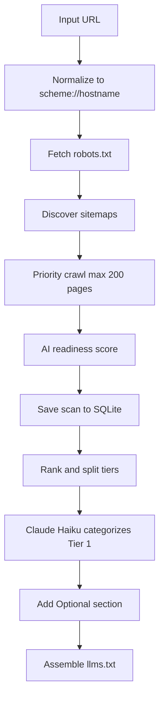

# Backend — llms.txt Generator

FastAPI backend that crawls a website and generates a spec-compliant [llms.txt](https://llmstxt.org) file.

## System Architecture




Generation progress is streamed to the frontend over **SSE** (`POST /generate/stream`) — stage changes and crawl counts arrive in real time while the pipeline runs. Page categorization uses **Claude Haiku** (`claude-haiku-4-5-20251001`): fast and cheap enough for per-request generation, with a deterministic fallback when no API key is set.

## How It Works

The crawler normalizes any input URL to the site root before crawling (e.g. `https://stripe.com/pricing` → `https://stripe.com`). This ensures the generated llms.txt reflects the entire site rather than a single section. The homepage is the highest-signal starting point — nav links from the root point to every major section, which feeds the page importance scorer.

### Site scope — `base_domain`

Every crawl derives a **registrable domain** from the input URL (e.g. `stripe.com` from `https://docs.stripe.com/api`). This answers: *what counts as the same site?*

- Computed by `registrable_domain()` in `url_utils.py` using `tldextract` (public suffix list).
- Used by `is_internal_link()` so subdomains (`docs.stripe.com`, `blog.stripe.com`) are treated as internal.
- **Tradeoff:** relies on the public suffix list. Edge cases on private suffixes or unusual hostnames may misclassify links (see [Known Limitations](#known-limitations)).

### Sitemap discovery

Sitemaps are the primary URL source when available. Discovery follows this order:

| Step | Behavior | Why |
|------|----------|-----|
| 1 | Read `Sitemap:` lines from `robots.txt` | Crawl rules and sitemap locations in one file. Many sites use non-default paths (`/docs/sitemap.xml`, CDN URLs). |
| 2 | Fallback to `/sitemap.xml` and `/sitemap_index.xml` | Large sites often use `sitemap_index.xml` (a sitemap of sitemaps) instead of a single file. |
| 3 | Merge priorities across sitemaps | Same URL in multiple sitemaps → keep the **higher** `<priority>` value (`_merge_sitemap_priorities` in `crawler.py`). |
| 4 | Seed crawl queue | Top 150 sitemap URLs by pre-crawl score enter the priority queue; BFS link discovery fills gaps. |

Nested sitemap indexes are followed recursively (depth and count capped). Bulk sitemaps (video/model indexes) are deprioritized or skipped to protect the 200-page crawl budget.

If no sitemap is available, the crawler falls back to BFS from the homepage.

### Crawl strategy

1. **Normalize** the input URL to a root origin (`scheme://hostname`).
2. **Discover sitemaps** — read `Sitemap:` URLs from `robots.txt`, then fall back to `/sitemap.xml` and `/sitemap_index.xml`. Nested sitemap indexes are fetched recursively. Seed the crawl queue with discovered `<loc>` entries.
3. **Fall back to BFS** from the homepage when no sitemap is available, following internal links up to `MAX_DEPTH` (default 3).
4. For each page, extract **title**, **meta description**, **h1**, and a **content hash** for dedup.
5. Stop after `MAX_PAGES` (default 200) pages — 185 main crawl + 15 optional reserve.

Pages are fetched in priority-queue order (highest importance score first, then depth, then URL).

### Page selection (llms.txt pipeline)

Pages are pre-filtered using a deterministic importance score (inbound link count, sitemap priority, nav placement, path depth, metadata quality) before categorization. This keeps the categorization prompt focused on the most relevant pages, reduces API cost, and ensures consistent results across runs.

1. **Pre-filter** — hard-skip patterns drop auth, search, asset, and noisy query-param URLs.
2. **Crawl** — up to 200 pages (185 main + 15 optional reserve for legal/press/blog paths).
3. **Tier 1 (top 100)** — sent to Claude Haiku; model picks **20** most useful pages and groups them into 4–6 site-specific `##` sections.
4. **Tier 2 (next 15)** — scanned for optional-pattern URLs (legal, press, careers, blog); up to **8** populate `## Optional`.
5. **Omitted** — remaining pages are intentionally excluded. llms.txt represents the most important parts of a site, not an exhaustive index.

Pages are ranked by importance score. The top 100 are categorized into main sections. The next tier is scanned for genuinely low-priority pages to populate a capped Optional section. Remaining pages are intentionally omitted.

### Approaches considered

| Approach | Problem |
|----------|---------|
| Static file → predetermined sections | Poor accuracy; doesn't account for diverse site structures |
| Pass 200 URLs + titles; LLM picks and sections in one shot | Too much context; inflates job size and cost |
| Two-pass LLM (pick top N, then group) | Two API calls; slower, less deterministic, still unreliable |
| **Chosen: code scores → LLM categorizes top tier** | More deterministic, faster, cheaper; LLM only does grouping and naming |

The chosen approach uses a single **Claude Haiku** call for categorization (plus an optional second call for site description when meta tags are missing). Without an API key, a deterministic fallback groups the top 20 pages under a single `Main` section.

### Deduplication

- **URL dedup:** URLs are normalized (lowercased host, stripped trailing slashes, removed UTM params) and hashed to avoid revisiting the same page via different links.
- **Content dedup:** Page body text is hashed so duplicate content served at different URLs can be detected downstream.

### Robots.txt

The crawler fetches `/robots.txt` before crawling and honors `Disallow` / `Allow` rules via `can_fetch` when the file loads successfully.

If robots.txt is missing, returns an error, or times out, we use a **fail-open** policy: assume crawling is allowed. This is standard for small crawlers — a missing robots.txt (404) is extremely common, and blocking the whole job would break most sites. When rules are available, we respect them.

### Rate limiting

Failed requests are retried up to 2 times with exponential backoff for rate limiting (429) and timeout errors, after which the page is skipped and the crawl continues.

## Setup

```bash
python3 -m venv .venv
source .venv/bin/activate
pip install -r requirements.txt
cp .env.example .env
```

## Running

```bash
uvicorn main:app --reload --port 8000
```

API runs at `http://localhost:8000`.

## Environment Variables

| Variable | Description |
|----------|-------------|
| `ANTHROPIC_API_KEY` | API key for page categorization and site description generation |
| `SCAN_DB_PATH` | Optional path to SQLite DB (default: `backend/data/scans.db`) |
| `SCAN_SCHEDULER_ENABLED` | Enable background rescan loop (default: `true`) |
| `SCAN_INTERVAL_HOURS` | Re-scan a domain after this many hours since `last_scanned_at` (default: `24`) |
| `SCAN_SCHEDULER_TICK_SECONDS` | How often the scheduler checks for due domains (default: `900` / 15 min) |

Copy `.env.example` to `.env` before running locally. Set `ANTHROPIC_API_KEY` for AI-assisted categorization. Do not commit `.env`.

## API

### `GET /scans`

List all persisted crawls, most recent first.

**Response:**

```json
[
  {
    "domain": "example.com",
    "url": "https://example.com",
    "pages_crawled": 42,
    "pages_included": 29,
    "readiness_total": 74,
    "has_content_changes": false,
    "has_unviewed_changes": false,
    "last_scanned_at": "2026-06-13T12:00:00Z",
    "generated": true
  }
]
```

### `GET /scans/{domain}`

Return persisted scan data for the analysis page. Used when loading `/analysis/{domain}` directly.

**Response:**

```json
{
  "domain": "example.com",
  "url": "https://example.com",
  "llms_txt": "# Example\n\n...",
  "pages_crawled": 42,
  "pages_included": 29,
  "readiness": { "total": 74, "categories": [], "recommendations": [] },
  "has_content_changes": false,
  "has_unviewed_changes": false,
  "last_scanned_at": "2026-06-13T12:00:00Z"
}
```

`llms_txt` is `null` when the domain was scanned but llms.txt has not been generated yet.

**Errors:** `404` if the domain has never been scanned.

### `POST /scans/{domain}/mark-viewed`

Clear the unviewed notification flag when the user opens the analysis page. Returns the updated scan.

### `POST /scans/{domain}/recrawl`

Re-crawl a domain, compare against the generation baseline, and auto-regenerate llms.txt when content changed. Manual recrawls do not set the home-screen unviewed badge.

`POST /scans/{domain}/refresh` is an alias for recrawl.

**Response:**

```json
{
  "domain": "example.com",
  "url": "https://example.com",
  "pages_crawled": 42,
  "pages_included": 29,
  "readiness": { "total": 74, "categories": [], "recommendations": [] },
  "has_content_changes": false,
  "has_unviewed_changes": false,
  "last_scanned_at": "2026-06-13T12:00:00Z",
  "llms_txt": "# Example\n\n...",
  "content_changed": true,
  "regenerated": true
}
```

### `POST /generate`

Crawl a website and return a generated llms.txt file (non-streaming).

**Request body:**

```json
{
  "url": "https://example.com"
}
```

**Response:**

```json
{
  "llms_txt": "# Example\n\n> An example website.\n\n...",
  "domain": "example.com",
  "pages_crawled": 42,
  "pages_included": 29,
  "readiness": {
    "total": 74,
    "max_total": 100,
    "categories": [
      { "id": "ai_bot_access", "label": "AI bot access", "score": 20, "max_score": 25 }
    ],
    "recommendations": ["Unblock GPTBot in robots.txt to allow ChatGPT to crawl your site"]
  },
  "has_content_changes": false,
  "has_unviewed_changes": false
}
```

### `POST /generate/stream`

Same as `POST /generate`, but streams progress as Server-Sent Events. Used by the frontend.

**SSE events:**

| Event | Payload | Description |
|-------|---------|-------------|
| `stage` | `{ "step": "checking_access" }` | Pipeline stage changed |
| `progress` | `{ "step": "crawling", "pages_crawled": 42 }` | Incremental progress during crawl |
| `complete` | Full generate response | Generation finished |
| `error` | `{ "detail": "..." }` | Generation failed |

After each successful generate, scan results are persisted to SQLite. Changes are detected by comparing crawled page hashes to the **generation baseline** (saved when llms.txt was last generated). The home **Updated** badge uses `has_unviewed_changes`, set by the background scheduler when new changes are detected.

### Background scheduler

On startup, a background task re-crawls due domains every 24 hours. When content changes, it auto-regenerates llms.txt and sets `has_unviewed_changes` until the user opens the analysis page.

**Errors:**

| Status | Detail |
|--------|--------|
| 422 | Invalid URL, robots blocked, or no pages could be crawled from this site |

## Project layout

```
backend/
├── main.py        # FastAPI routes
├── models.py      # Pydantic request/response models
├── scan.py        # Crawl + readiness orchestration (run_scan)
├── db.py          # SQLite persistence for scans and page hashes
├── changes.py     # Content-hash change detection
├── regenerate.py  # Recrawl + auto-regenerate orchestration
├── scheduler.py   # Background 24h rescan loop
├── crawler.py     # Async site crawler (httpx)
├── readiness.py   # AI readiness scoring from crawl artifacts
├── generator.py   # Claude categorization + llms.txt assembly
├── scoring.py     # Page importance ranking and tier selection
├── url_utils.py   # URL normalization, dedup, skip filters
└── constants.py   # Shared limits, patterns, and crawl tuning
```

## Configuration

### `constants.py` — shared limits

| Constant | Default | Description |
|----------|---------|-------------|
| `MAX_DEPTH` | 3 | Maximum BFS link-follow depth |
| `TIER_1_SIZE` | 100 | Pages sent to Claude for main sections |
| `TIER_2_CANDIDATES` | 15 | Pages scanned for the Optional section |
| `OPTIONAL_CAP` | 8 | Max links in the `## Optional` section |
| `SITEMAP_SEED_LIMIT` | 150 | Max sitemap URLs seeded into the crawl queue |
| `MAX_SITEMAP_URLS` | 5,000 | Max page URLs parsed from sitemaps |
| `MAX_NESTED_SITEMAPS` | 8 | Max child sitemap documents fetched |
| `MAX_SITEMAP_DEPTH` | 3 | Max sitemap index nesting depth |

### `crawler.py` — HTTP crawl tuning

| Constant | Default | Description |
|----------|---------|-------------|
| `MAX_PAGES` | 200 | Maximum number of pages to crawl |
| `MAX_CONCURRENCY` | 20 | Concurrent HTTP requests per batch |
| `TIMEOUT` | 5s | HTTP request timeout |
| `MAX_FETCH_RETRIES` | 2 | Retries for 429 and timeout errors before skipping a page |

### `generator.py` — llms.txt output limits

| Constant | Default | Description |
|----------|---------|-------------|
| `MAX_PAGES_TO_SELECT` | 20 | Pages Claude picks for main sections |
| `MAX_LINKS_PER_SECTION` | 15 | Max links per `##` section |
| `MAX_TOTAL_LINKS` | 100 | Max links across the whole file |
| `MIN_DESCRIPTION_LENGTH` | 20 | Min description length to include a link |

## Known Limitations

- **Registrable-domain matching uses `tldextract`** (public suffix list). Edge cases on private suffixes or unusual hostnames may still misclassify internal links.
- **Page budget is capped at 200.** Large sites will only have a subset represented. Pages are ranked by importance score before selection.
- **JavaScript-rendered content is not supported.** The crawler fetches raw HTML only. Single-page apps or sites that load content dynamically via JavaScript will return empty or incomplete data.
